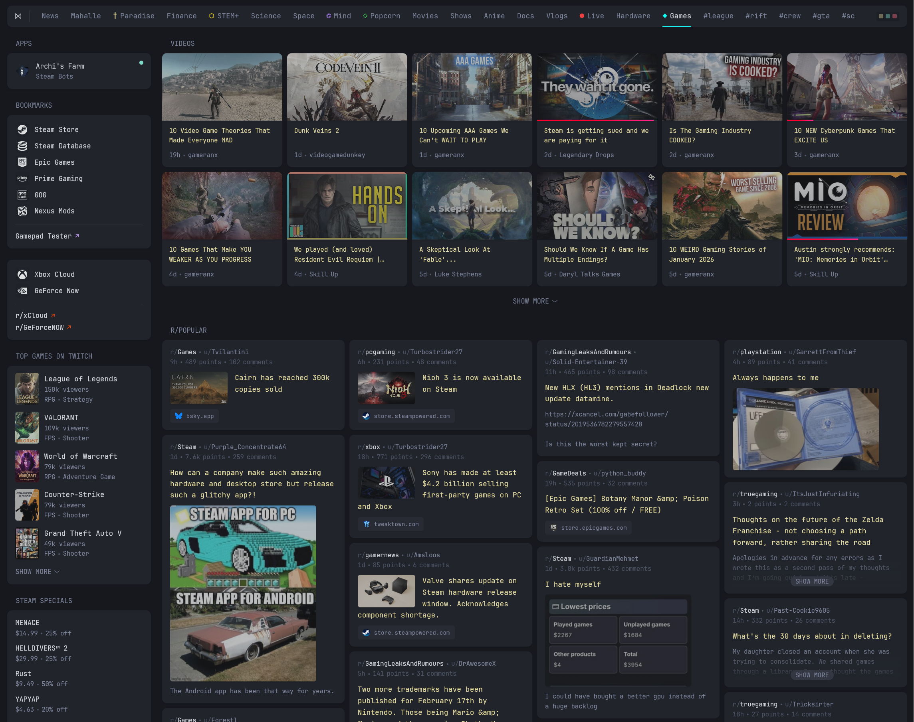
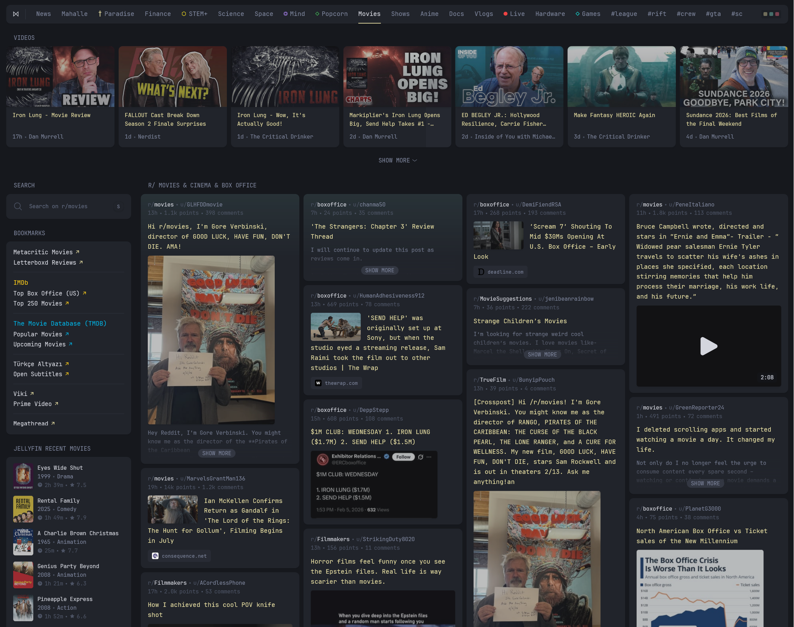
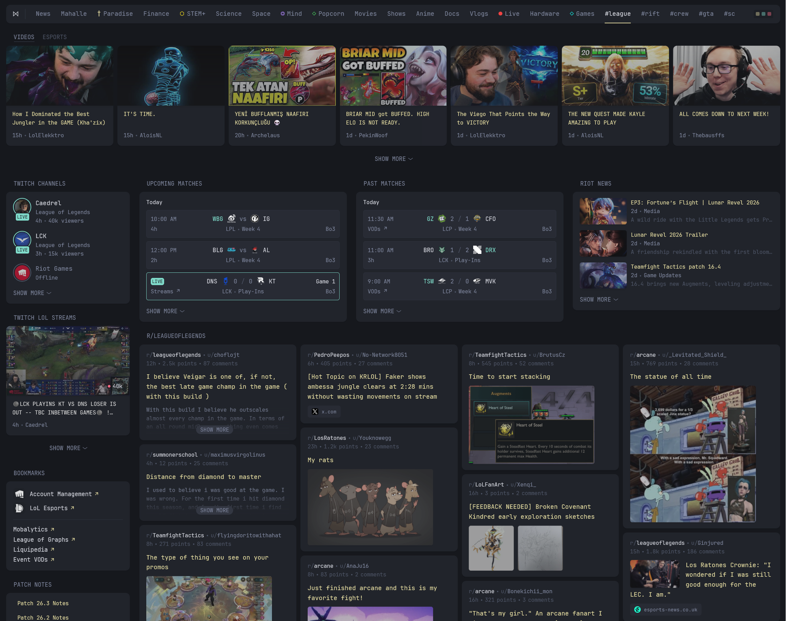
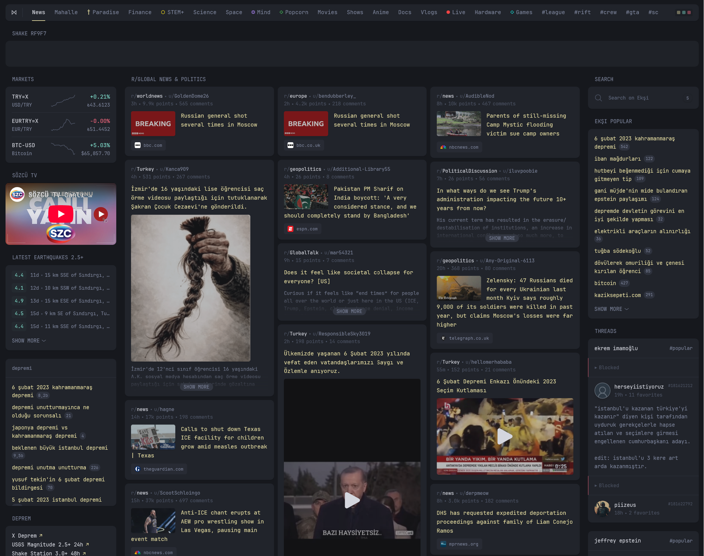

# Glance

A customizable personal dashboard built with Go templates and YAML configuration.

## Getting Started

```bash
cp example.env .env
docker-compose up -d
```

- **Hub**: http://localhost:8080
- **Dev**: http://localhost:8082
- **Test**: http://localhost:8084

## Project Structure

| Directory     | Purpose                                                                  |
| ------------- | ------------------------------------------------------------------------ |
| `config/`     | Dashboard environments (dev, hub, test) with pages                       |
| `widgets/`    | Widget implementations (audiobookshelf, jellyfin, twitch, youtube, etc.) |
| `shared/`     | Global theme, variables, definitions                                     |
| `components/` | Reusable Go templates (list, media, gallery, etc.)                       |
| `assets/`     | Styles (CSS), scripts (JS), images, favicons                             |

## Configuration

Each environment (`dev/`, `hub/`, `test/`) contains:

- `glance.yml` - Main dashboard configuration
- `pages/` - Individual page definitions

Global settings:

- `shared/theme.yml` - Themes
- `shared/variables.yml` - Variables
- `shared/definitions.yml` - Pre-defined yaml anchors

## Customization

- **Add pages**: Create YAML files in `config/{env}/pages/`
- **Create widgets**: Add `.yml` + `.gohtml` files in `widgets/`
- **Override styles**: Edit `assets/custom.css`
- **Add scripts**: Edit `assets/custom.js`

## Screenshots

[config/dev/pages/dash.yml](config/dev/pages/dash.yml)


[config/dev/pages/selfhost.yml](config/dev/pages/selfhost.yml)


[config/hub/pages/gaming/games.yml](config/hub/pages/gaming/games.yml)


[config/hub/pages/movies.yml](config/hub/pages/movies.yml)


[config/hub/pages/gaming/league-of-legends.yml](config/hub/pages/gaming/league-of-legends.yml)


[config/hub/pages/news.yml](config/hub/pages/news.yml)

