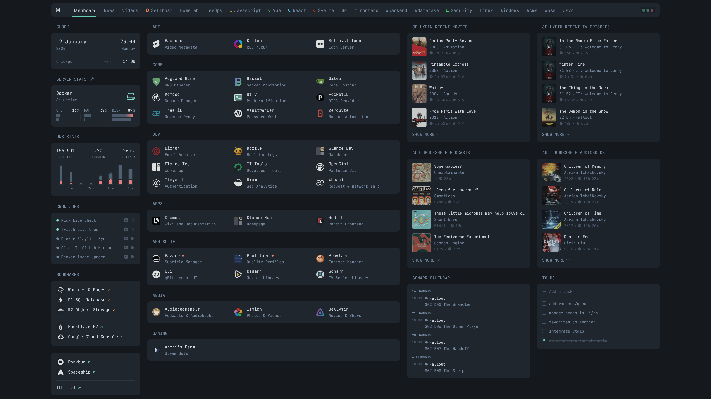
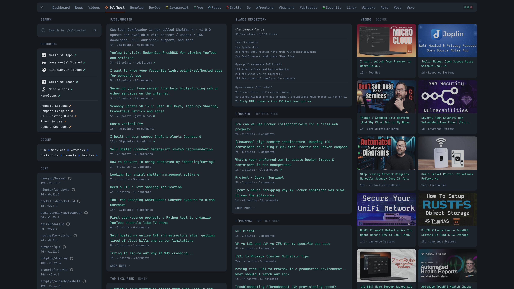
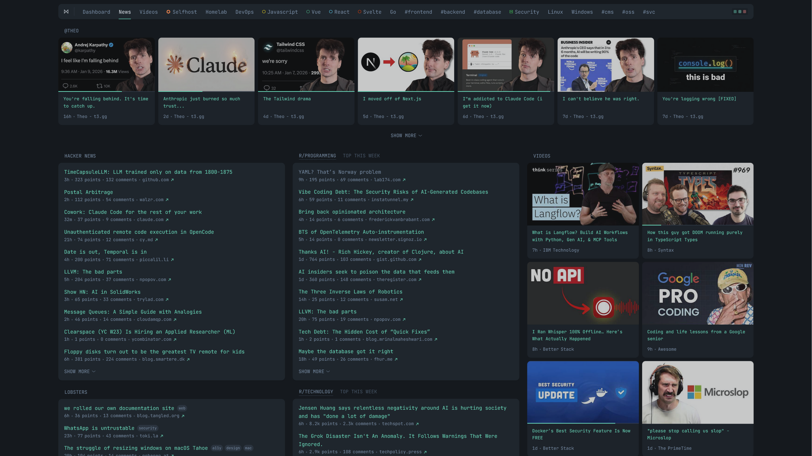
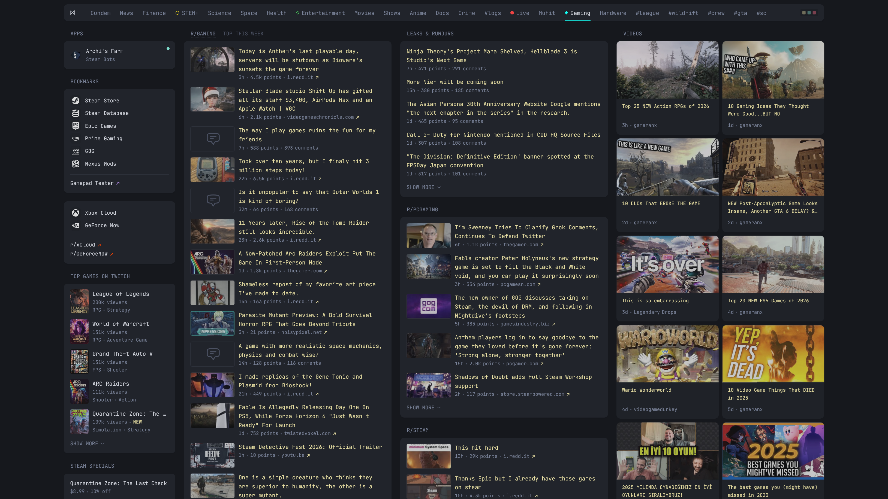
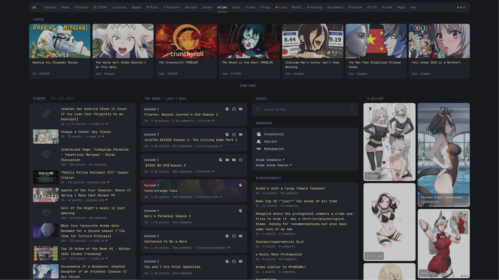
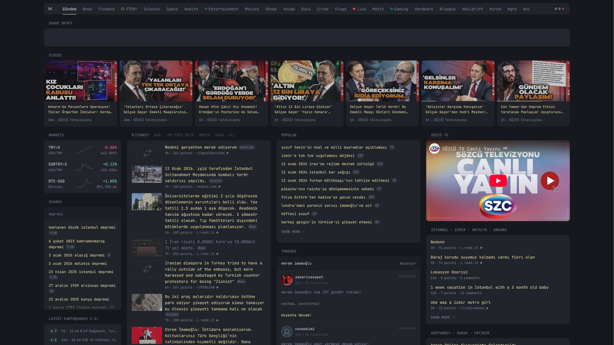
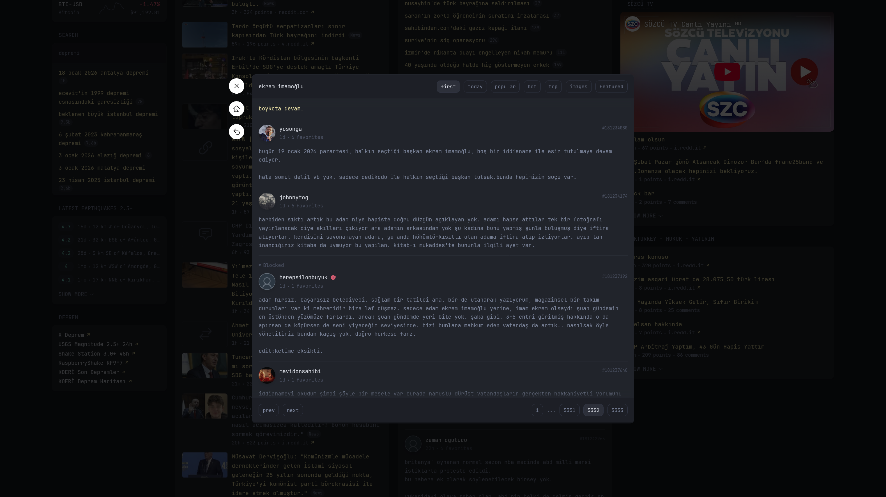

# Glance

A customizable personal dashboard built with Go templates and YAML configuration.

## Getting Started

```bash
cp example.env .env
docker-compose up -d
```

- **Hub**: http://localhost:8080
- **Dev**: http://localhost:8082
- **Test**: http://localhost:8084

## Project Structure

| Directory | Purpose |
|-----------|---------|
| `config/` | Dashboard environments (dev, hub, test) with pages |
| `widgets/` | Widget implementations (audiobookshelf, jellyfin, twitch, youtube, etc.) |
| `shared/` | Global theme, variables, definitions, index |
| `components/` | Reusable Go templates (list, media, gallery, etc.) |
| `assets/` | Styles (CSS), scripts (JS), images, favicons |

## Configuration

Each environment (`dev/`, `hub/`, `test/`) contains:
- `glance.yml` - Main dashboard configuration
- `pages/` - Individual page definitions

Global settings:
- `shared/theme.yml` - Colors and appearance
- `shared/variables.yml` - Reusable variables
- `shared/definitions.yml` - Widget definitions

## Customization

- **Add pages**: Create YAML files in `config/{env}/pages/`
- **Create widgets**: Add `.yml` + `.gohtml` files in `widgets/`
- **Override styles**: Edit `assets/custom.css`
- **Add scripts**: Edit `assets/custom.js`

## Screenshots

[config/dev/pages/dash.yml](config/dev/pages/dash.yml)


[config/dev/pages/selfhost.yml](config/dev/pages/selfhost.yml)


[config/dev/pages/news.yml](config/dev/pages/news.yml)


[config/hub/pages/gaming.yml](config/hub/pages/gaming.yml)


[config/hub/pages/anime.yml](config/hub/pages/anime.yml)


[config/hub/pages/vlogs.yml](config/hub/pages/vlogs.yml)


[config/hub/pages/gundem.yml](config/hub/pages/gundem.yml)


